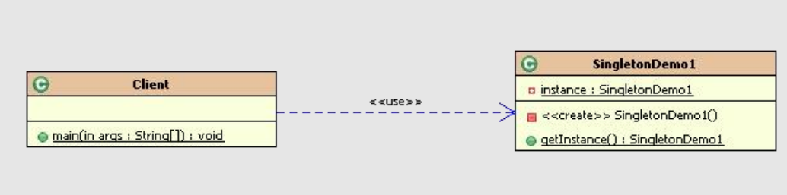
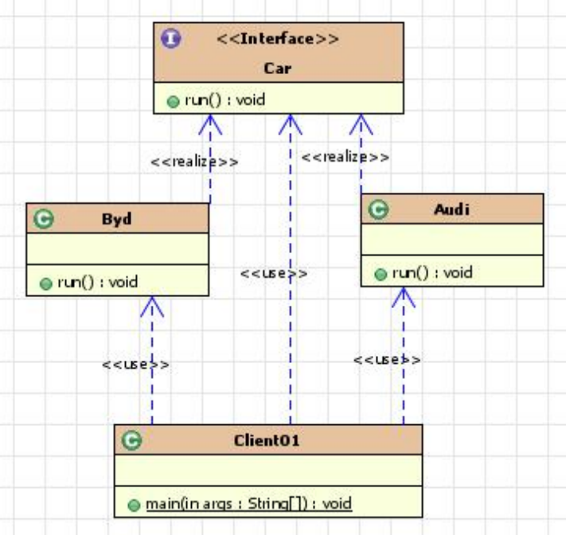
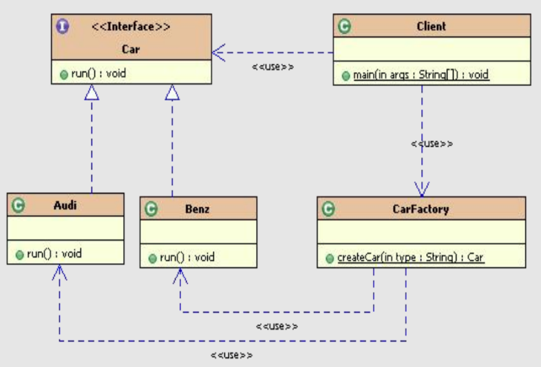
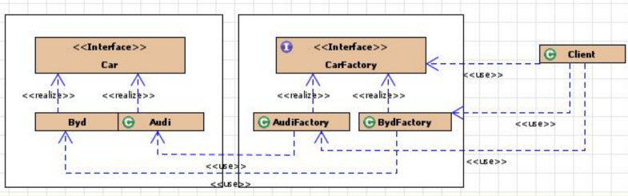
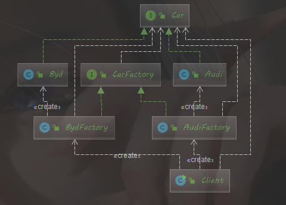
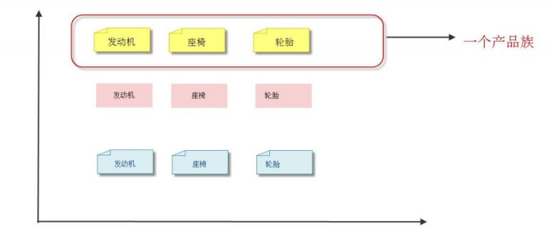
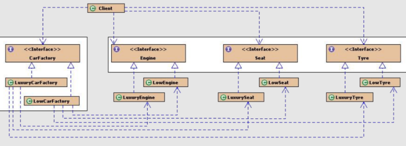
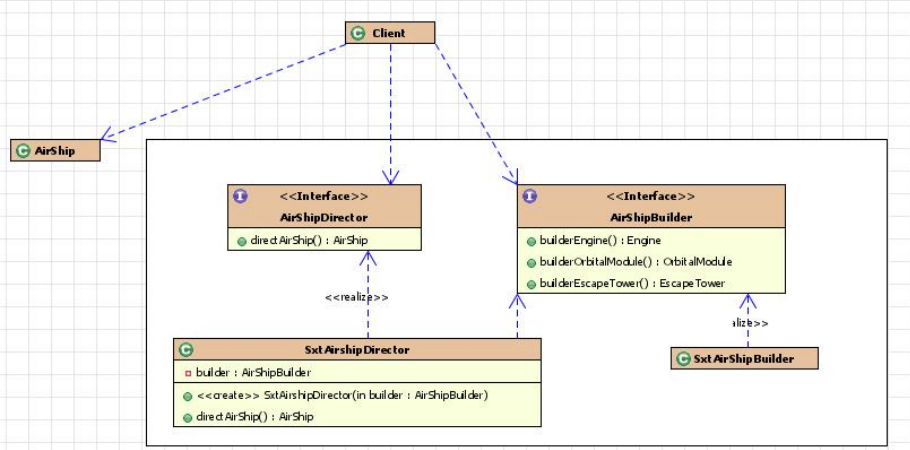

# 设计模式

**• 创建型模式：**

**– 单例模式、工厂模式、抽象工厂模式、建造者模式、原型模式。**
**• 结构型模式：**
**– 适配器模式、桥接模式、装饰模式、组合模式、外观模式、享元模式、代理模**
**式。**
**• 行为型模式：**
**– 模版方法模式、命令模式、迭代器模式、观察者模式、中介者模式、备忘录模**
**式、解释器模式、状态模式、策略模式、职责链模式、访问者模式。**


## 1.单例模式

### 核心作用：

– 保证一个类只有一个实例，并且提供一个访问该实例的全局访问点。

### 常见应用场景：

– Windows的Task Manager（任务管理器）就是很典型的单例模式
– windows的Recycle Bin（回收站）也是典型的单例应用。在整个系统运行过程中，回收站一直维护着仅有的一个实例。
– 项目中，读取配置文件的类，一般也只有一个对象。没有必要每次使用配置文件数据，每次new一个对象去读取。
– 网站的计数器，一般也是采用单例模式实现，否则难以同步。
– 应用程序的日志应用，一般都何用单例模式实现，这一般是由于共享的日志文件一直处于打开状态，因为只能有一个实例去操作
，否则内容不好追加。
– 数据库连接池的设计一般也是采用单例模式，因为数据库连接是一种数据库资源。
– 操作系统的文件系统，也是大的单例模式实现的具体例子，一个操作系统只能有一个文件系统。
– Application 也是单例的典型应用（Servlet编程中会涉及到）
– 在Spring中，每个Bean默认就是单例的，这样做的优点是Spring容器可以管理
– 在servlet编程中，每个Servlet也是单例
– 在spring MVC框架/struts1框架中，控制器对象也是单例

### 单例模式的优点：

– 由于单例模式只生成一个实例，减少了系统性能开销，当一个对象的产生需要
比较多的资源时，如读取配置、产生其他依赖对象时，则可以通过在应用启动
时直接产生一个单例对象，然后永久驻留内存的方式来解决
– 单例模式可以在系统设置全局的访问点，优化环共享资源访问，例如可以设计
一个单例类，负责所有数据表的映射处理

###  常见的五种单例模式实现方式：

– 主要：

• 饿汉式（线程安全，调用效率高。 但是，不能延时加载。）

• 懒汉式（线程安全，调用效率不高。 但是，可以延时加载。）

– 其他：

• 双重检测锁式（由于JVM底层内部模型原因，偶尔会出问题。不建议使用）

• 静态内部类式(线程安全，调用效率高。 但是，可以延时加载)

• 枚举式(线程安全，调用效率高，不能延时加载。并且可以天然的防止反射和反序列化漏洞！)

如何选用?
– 单例对象 占用 资源 少，不需要 延时加载：
• 枚举式 好于 饿汉式
– 单例对象 占用 资源 大，需要 延时加载：
• 静态内部类式 好于 懒汉式

#### 1.饿汉式实现（单例对象立即加载）

```java
public class SingletonDemo02 {
	private static  SingletonDemo02 s = new SingletonDemo02();
	private SingletonDemo02(){} //私有化构造器
	public static SingletonDemo02 getInstance(){
	return s;}
}

public class Client {
public static void main(String[] args) {
SingletonDemo02 s = SingletonDemo02.getInstance();
SingletonDemo02 s2 = SingletonDemo02.getInstance();
System.out.println(s==s2); //结果为true
}
}

```

饿汉式单例模式代码中，static变量会在类装载时初始化，此时也不会涉及多个线程对象访问该对象的问
题。

虚拟机保证只会装载一次该类，肯定不会发生并发访问的问题。因此，可以省略synchronized关键字。

• **问题：如果只是加载本类，而不是要调用getInstance()，甚至永远没有调用，则会造成资源浪费！**


#### 2.懒汉式实现（单例对象延迟加载）

```java
public class SingletonDemo01 {
private static SingletonDemo01 s;
private SingletonDemo01(){} //私有化构造器
public static synchronized SingletonDemo01 getInstance(){
if(s==null){
s = new SingletonDemo01();
}
return s;
}
}
```

要点：
**– lazy load! 延迟加载， 懒加载！ 真正用的时候才加载！**
**• 问题：**
**– 资源利用率高了。但是，每次调用getInstance()方法都要同步，并发**
**效率较低。**


#### 3.双重检测锁实现（了解即可）

```java
public class SingletonDemo03 {
private static SingletonDemo03 instance = null;
public static SingletonDemo03 getInstance() {
if (instance == null) {
SingletonDemo03 sc;
synchronized (SingletonDemo03.class) {
sc = instance;
if (sc == null) {
synchronized (SingletonDemo03.class) {
if(sc == null) {
sc = new SingletonDemo03();
}
}
instance = sc;
}
}
}
return instance;
}
private SingletonDemo03() {
}
}
```


这个模式将同步内容下方到if内部，提高了执行的效率
不必每次获取对象时都进行同步，只有第一次才同步
创建了以后就没必要了。

问题：
• **由于编译器优化原因和JVM底层内部模型原因，**
**偶尔会出问题。不建议使用。**


#### 4.静态内部类实现方式(也是一种懒加载方式)

```java
public class SingletonDemo04 {
private static class SingletonClassInstance {
private static final SingletonDemo04 instance = new SingletonDemo04();
}
public static SingletonDemo04 getInstance() {
return SingletonClassInstance.instance;
}
private SingletonDemo04() {
}
}
```


要点：
– 外部类没有static属性，则不会像饿汉式那样立即加载对象。
– 只有真正调用getInstance(),才会加载静态内部类。加载类时是线程 安全的。 instance是static final
类型，保证了内存中只有这样一个实例存在，而且只能被赋值一次，从而保证了线程安全性. – 兼备了并发高效调用和延迟加载的优势！


#### 5.使用枚举实现单例模式

```java
public enum SingletonDemo05 {
/**
* 定义一个枚举的元素，它就代表了Singleton的一个实例。
*/
INSTANCE;
/**
* 单例可以有自己的操作
*/
public void singletonOperation(){
//功能处理
}
}
```

优点：
**– 实现简单**
**– 枚举本身就是单例模式。由JVM从根本上提供保障！避免通过反射和反序列化的漏洞！**
**• 缺点：**
**– 无延迟加载**

### 问题：

– 反射可以破解上面几种(不包含枚举式)实现方式！（可以在构造方法中手动
抛出异常控制）
– 反序列化可以破解上面几种((不包含枚举式))实现方式！
• 可以通过定义readResolve()防止获得不同对象。
– 反序列化时，如果对象所在类定义了readResolve()，（实际是一种回调），
定义返回哪个对象。

```java
public class SingletonDemo01 implements Serializable {
private static SingletonDemo01 s;
private SingletonDemo01() throws Exception{
if(s!=null){
throw new Exception("只能创建一个对象");
//通过手动抛出异常，避免通过反射创建多个单例对象！
}
} //私有化构造器
public static synchronized SingletonDemo01 getInstance() throws Exception{
if(s==null){
s = new SingletonDemo01();
}
return s;
}
//反序列化时，如果对象所在类定义了readResolve()，（实际是一种回调），定义返回哪个对象。
private Object readResolve() throws ObjectStreamException {
return s;
}
}
```

CountDownLatch
– 同步辅助类，在完成一组正在其他线程中执行的操作之前，它允许一
个或多个线程一直等待。
• countDown() 当前线程调此方法，则计数减一(建议放在 finally里执行)
• await()， 调用此方法会一直阻塞当前线程，直到计时器的值为0




## 2.工厂模式：实现了创建者和调用者的分离

### 核心本质：

– 实例化对象，用工厂方法代替new操作。
– 将选择实现类、创建对象统一管理和控制。从而将调用者跟我们的实现类解耦。

### 分类：

– 简单工厂模式
**• 用来生产同一等级结构中的任意产品。（对于增加新的产品，需要修改已**
**有代码）**
– 工厂方法模式
**• 用来生产同一等级结构中的固定产品。（支持增加任意产品）**
– 抽象工厂模式
**• 用来生产不同产品族的全部产品。（对于增加新的产品，无能为力；支持**
**增加产品族）**

### 应用场景

– JDK中Calendar的getInstance方法
– JDBC中Connection对象的获取
– Hibernate中SessionFactory创建Session
– spring中IOC容器创建管理bean对象
– XML解析时的DocumentBuilderFactory创建解析器对象
– 反射中Class对象的newInstance()

### 1.简单工厂模式

#### 1.1不使用简单工厂的情况

~~~java
public class Client01 { //调用者
public static void main(String[] args) {
Car c1 = new Audi();
Car c2 = new Byd();
c1.run();
c2.run();
}
}
~~~



#### 1.2简单工厂

#### 要点：

– 简单工厂模式也叫静态工厂模式，就是工厂类一般是使用静态方法，
通过接收的参数的不同来返回不同的对象实例。
– 对于增加新产品无能为力！不修改代码的话，是无法扩展的

~~~java
public class CarFactory {
public static Car createCar(String type){
Car c = null;
if("奥迪".equals(type)){
c = new Audi();
}else if("奔驰".equals(type)){
c = new Benz();
}
return c;
}
}
~~~

~~~java
public class CarFactory {
public static Car createAudi(){
return new Audi();
}
public static Car createBenz(){
return new Benz();
}
}
~~~



### 2.工厂方法模式

工厂方法模式要点：
– 为了避免简单工厂模式的缺点，不完全满足OCP。
– 工厂方法模式和简单工厂模式最大的不同在于，简单工厂模式只有一个（对于一个项目
或者一个独立模块而言）工厂类，而工厂方法模式有一组实现了相同接口的工厂类。

```java
public  class Client  {
	public static void main(String[] args) {
		Car c1 = new AudiFactory().createCar();
		Car c2 = new BydFactory().createCar();
		
		c1.run();
		c2.run();
	}
}
```






### 3.抽象工厂模式

抽象工厂模式
– 用来生产不同产品族的全部产品。（对于增加新的产品，无能为力；
支持增加产品族）
– 抽象工厂模式是工厂方法模式的升级版本，在有多个业务品种、业务
分类时，通过抽象工厂模式产生需要的对象是一种非常好的解决方式。

~~~java
public class Client {
    public static void main(String[] args) {
     CarFactory factory = new LuxuryCarFactory();
        Engine engine = factory.createEngine();
        engine.run();
        engine.start();
        factory.createXXX();
    }
}

~~~






## 3.建造者模式

##### 1、定义：将一个复杂对象的构建与它的表示分离，使得同样的构建过程可以创建不同的表示

##### 2、主要作用：在用户不知道对象的建造过程和细节的情况下就可以直接创建复杂的对象。

##### 3、如何使用：用户只需要给出指定复杂对象的类型和内容，建造者模式负责按顺序创建复杂对象（把内部的建造过程和细节隐藏起来）

##### 4、解决的问题：

​        （1）、方便用户创建复杂的对象（不需要知道实现过程）
​        （2）、代码复用性 & 封装性（将对象构建过程和细节进行封装 & 复用）

###### 5、注意事项：与工厂模式的区别是：建造者模式更加关注与零件装配的顺序，一般用来创建更为复杂的对象

### 实现方式

> （1）通过Client、Director、Builder和Product形成的建造者模式
>
> （2）通过静态内部类方式实现零件无序装配话构造


### 1.通过Client、Director、Builder和Product形成的建造者模式

一般有以下几个角色
抽象建造者（builder）：描述具体建造者的公共接口，一般用来定义建造细节的方法，并不涉及具体的对象部件的创建。

具体建造者（ConcreteBuilder）：描述具体建造者，并实现抽象建造者公共接口。

指挥者（Director）：调用具体建造者来创建复杂对象（产品）的各个部分，并按照一定顺序（流程）来建造复杂对象。

产品（Product）：描述一个由一系列部件组成较为复杂的对象。

（2）举个例子
既然是建造者模式，那么就继续造火箭吧

假设造房简化为如下步骤：（1）轨道舱（2）发动机（3）逃逸塔

“如果”要造一艘火箭，首先要找航天部的科学家（指挥者）。承包商指挥工人（具体建造者）过来造火箭（产品），最后验收。

（3）具体步骤
1、创建抽象建造者定义造火箭步骤

2、创建工人具体实现造火箭步骤

3、创建承包商指挥工人施工

4、验收，检查是否建造完成




（2）通过静态内部类方式实现零件无序装配话构造/通过构造函数装配特定属性，返回指定熟悉类(已加载属性)

Eg：Swagger2的 ApiInfo类的装配过程

~~~java
public class ApiInfoBuilder {
  private String title;
  private String description;
  private String termsOfServiceUrl;
  private Contact contact;
  private String license;
  private String licenseUrl;
  private String version;
  private List<VendorExtension> vendorExtensions = newArrayList();

  public ApiInfoBuilder title(String title) {
    this.title = title;
    return this;
  }

  public ApiInfoBuilder description(String description) {
    this.description = description;
    return this;
  }

  public ApiInfoBuilder termsOfServiceUrl(String termsOfServiceUrl) {
    this.termsOfServiceUrl = termsOfServiceUrl;
    return this;
  }

  public ApiInfoBuilder version(String version) {
    this.version = version;
    return this;
  }

  @Deprecated
  public ApiInfoBuilder contact(String contact) {
    this.contact = new Contact(contact, "", "");
    return this;
  }
  public ApiInfoBuilder contact(Contact contact) {
    this.contact = contact;
    return this;
  }

  public ApiInfoBuilder license(String license) {
    this.license = license;
    return this;
  }

  public ApiInfoBuilder licenseUrl(String licenseUrl) {
    this.licenseUrl = licenseUrl;
    return this;
  }

  public ApiInfoBuilder extensions(List<VendorExtension> extensions) {
    this.vendorExtensions.addAll(nullToEmptyList(extensions));
    return this;
  }

  public ApiInfo build() {
    return new ApiInfo(title, description, version, termsOfServiceUrl, contact, license, licenseUrl, vendorExtensions);
  }
}
~~~

### 总结

（1）优点
1、产品的建造和表示分离，实现了解耦。

2、将复杂产品的创建步骤分解在不同的方法中，使得创建过程更加清晰

3、增加新的具体建造者无需修改原有类库的代码，易于拓展，符合“开闭原则“。

（2）缺点
1、产品必须有共同点，限制了使用范围。

 2、如内部变化复杂，会有很多的建造类，难以维护。

（3）应用场景
1、需要生成的产品对象有复杂的内部结构，这些产品对象具备共性；

2、隔离复杂对象的创建和使用，并使得相同的创建过程可以创建不同的产品。

3、需要生成的对象内部属性本身相互依赖。

4、适合于一个具有较多的零件（属性）的产品（对象）的创建过程。